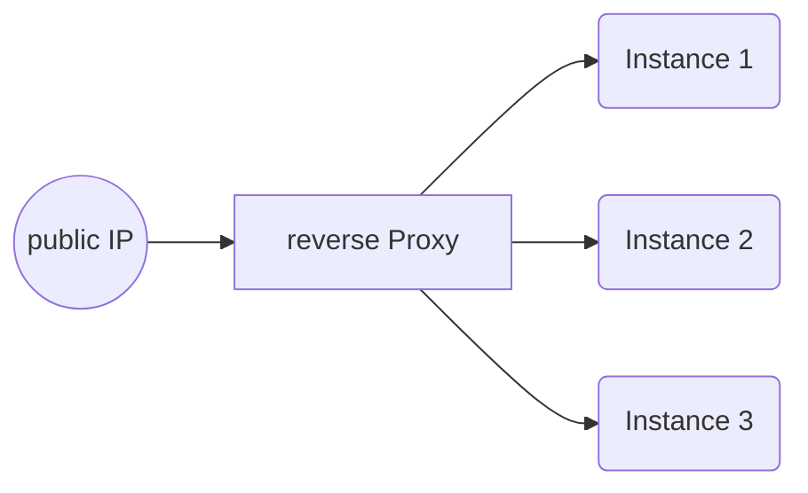
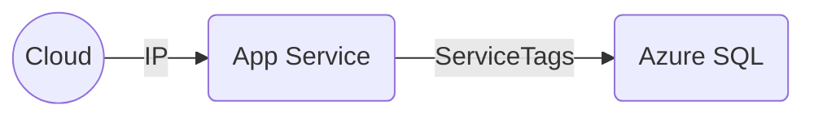
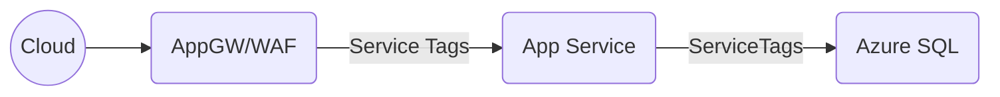
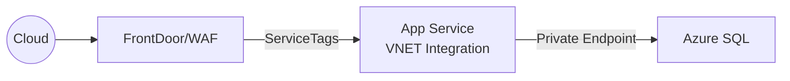
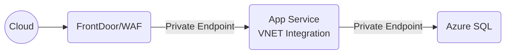
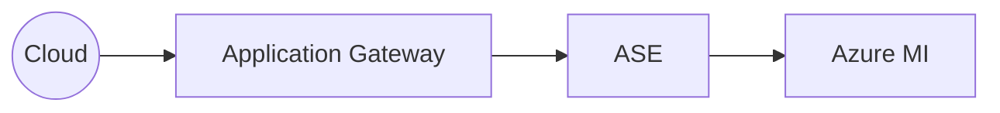

# Azure App Services Networking

## App Service Design

- App Service have a reverse proxy into the instances
- Reverse proxy exposes a public IP

## Other best practices
- Enable identity
- Enable encryption at rest
- Enable caching
- Enable logging and monitoring

## Desings in order or improved security

### App Service with IP Filter & Data with ServiceTags

Azure Services:
- App Service plan
- App Service Web App
- Azure SQL

Security at this level:
- No WAF (recommended)
- TLS enforced and custom certificate can be added to the Web App
- Traffic into the web app can be limited to one IP (i.e. the corporate firewall IP). Otherwise, it is encrypted but open.
- Traffic from App to Data can only come from app services by setting the ServiceTags in the Database firewall settings.
- All traffic traverses the internet

### Application Gateway, App Service with Service Tags, and Data Firewall with Service Tags

Azure Services:
- VNET
- Application Gateway in WAF mode deployed to a subnet
- App Service plan
- App Service Web App
- Azure SQL

Security at this level:
- TLS enforced and cad add custom certificate
- Application Gateway can do SSL offloading but can also handle end-to-end encryption
- Traffic into the web app can only come from application gateway
- Traffic from App to Data can only come from app services via database firewall using ServiceTags
- All traffic traverses the internet

### FrontDoor Standard, App Service with Service Tags and VNET integration, and Data Private Endpoint

Azure Services:
- Azure FrontDoor Standard Plan
- VNET
- App Service plan
- App Service Web App with VNET integration
  - Note: VNET integration requires a backend subnet in a VNET 
- Private DNS Zone (Azure SQL)
- Private Endpoint deployed to a VNET subnet
- Private Endpoint for Azure SQL
- Azure SQL under Private Endpoint

Security at this level:
- TLS enforced and cad add custom certificate to Azure Froont Door for SSL offloading or end-to-end encryption
- Traffic into the web app can only come from Azure FrontDoor
- Traffic from App to Data can only come from app services via the backend subnet into the Private Endpoint into Azure SQL
- Traffic between the Web App and Data traverses the Azure backbone
- Traffic from the FrontDoor to the App goes over the internet

### FrontDoor Premium, App Service under Private Endpoint and VNET integration, and Data Private Endpoint

Azure Services:
- Azure FrontDoor Premium Plan
- VNET
- App Service plan
- App Service Web App under Private Endpoint with VNET integration
  - Note: VNET integration requires a backend subnet in a VNET 
- Private DNS Zones (Azure SQL and Websites)
- Private Endpoints deployed to a VNET subnet
- Private Endpoint for Azure SQL
- Azure SQL under Private Endpint

Security at this level:
- TLS enforced and cad add custom certificate to Azure Froont Door for SSL offloading or end-to-end encryption
- Traffic into the web app can only come from Azure FrontDoor and the Azure backbone
- Traffic from App to Data can only come from app services via the backend subnet into the Private Endpoint into Azure SQL
- All traffic flows inside the Microsoft backbone

### App Service Environments

