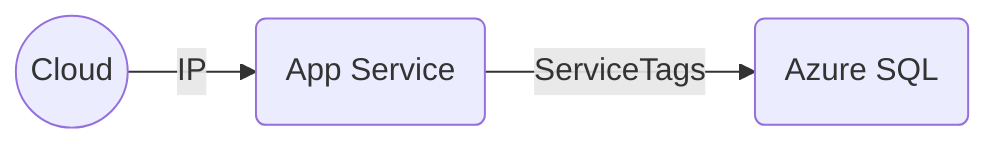
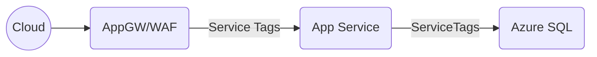
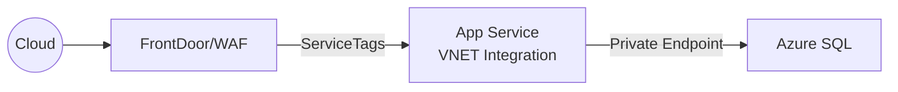

# Azure App Services Networking

## App Service Design

- App Service have a reverse proxy into the instances
- Reverse proxy has a public IP

## Possible designs in order of improved security

### App Service with IP Filter & Data with ServiceTags

Azure Services:
- App Service plan
- App Service Web App
- Azure SQL

Security at this level:
- No WAF (recommended)
- TLS enforced and cad add custom certificate
- Traffic into the web app can be limited to one IP (i.e. the corporate firewall IP). Otherwise, it is encrypted but open.
- Traffic from App to Data can only come from app services
- All traffic traverses the internet

### Application Gateway, App Service with Service Tags, and Data Firewall with Service Tags

Azure Services:
- VNET
- Application Gateway in WAF mode deployed to a subnet
- App Service plan
- App Service Web App
- Azure SQL

Security at this level:
- TLS enforced and cad add custom certificate
- Application Gateway can do SSL offloading but can also handle end-to-end encryption
- Traffic into the web app can only come from application gateway
- Traffic from App to Data can only come from app services via database firewall using ServiceTags
- All traffic traverses the internet

### FrontDoor, App Service with Service Tags and VNET integration, and Data Private Endpoint

### FrontDoor, 
