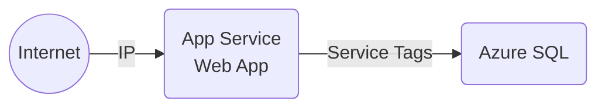
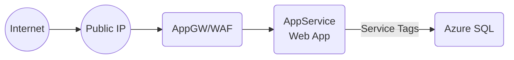
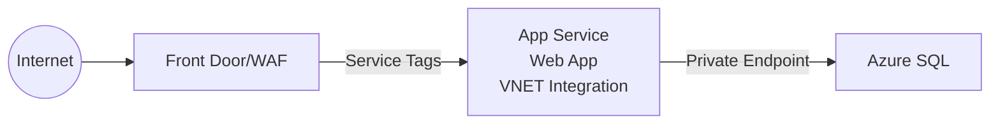
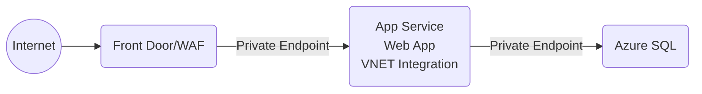
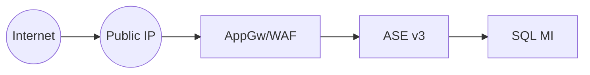

# Azure App Services Networking

Many customers coming to Azure ask the question, "is our design secure?" Security is a big and important topic, but a good answer has to do with meeting the security compliance requirements of your organization. Understanding which model will meet these requirements is key to being in compliance.

The purpose of this post is to be able to quickly compare the different secuirty consideration for different App Services networking models. For simplicity, the post is based on a two-tier architecture application, but this can quickly be extended to 3-tier, microservices, and other more complex architectures involving other Azure Services as the same concepts apply.

## App Service Design - Where is that Public IP?

- An App Service has a reverse proxy into the instances
- The reverse proxy exposes a public IP

## Other security best practices for App Services
- Enable identity
- Enable encryption at rest
- For ASE, be careful not to block certain ports (via NSGs) which are required for the service to operate correctly
- Enable logging and monitoring

## App Services solution deployments in order or improved security

### App Service with IP Filter & Data with Service Tags

Azure Services:
- App Service plan
- App Service Web App
- Azure SQL

Security at this level:
- No WAF (recommended)
- TLS enforced and custom certificate can be added to the Web App
- Traffic into the web app can be limited to one IP (i.e. the corporate firewall IP). Otherwise, it is encrypted but open.
- Traffic from App to Data can only come from app services by setting the ServiceTags in the Database firewall settings.
- All traffic traverses the internet

### Application Gateway, App Service with Service Tags, and Data Firewall with Service Tags

Azure Services:
- Public IP
- VNET
- Application Gateway in WAF mode deployed to a subnet
- App Service plan
- App Service Web App
- Azure SQL

Security at this level:
- Public IP (DDOS protection)
- WAF protection
- TLS enforced and custom certificate can be added to the Web App
- Application Gateway can do SSL offloading but can also handle end-to-end encryption
- Traffic into the web app can only come from application gateway
- Traffic from App to Data can only come from app services via database firewall using ServiceTags
- All traffic traverses the internet

### FrontDoor Standard, App Service with Service Tags and VNET integration, and Data Private Endpoint

Azure Services:
- Azure FrontDoor Standard Plan
- VNET
- NSG
- App Service plan
- App Service Web App with VNET integration
  - Note: VNET integration requires a backend subnet in a VNET 
- Private DNS Zone (Azure SQL)
- Private Endpoint deployed to a VNET subnet
- Private Endpoint for Azure SQL
- Azure SQL under Private Endpoint

Security at this level:
- WAF protection
- TLS enforced and cad add custom certificate to Azure Froont Door for SSL offloading or have end-to-end encryption
- Traffic into the web app can only come from Azure FrontDoor
- Traffic from App to Data can only come from app services via the backend subnet into the Private Endpoint into Azure SQL
- Traffic between the Web App and Data traverses the Azure backbone
- Traffic from the FrontDoor to the App goes over the internet

### FrontDoor Premium, App Service under Private Endpoint and VNET integration, and Data Private Endpoint

Azure Services:
- Azure FrontDoor Premium Plan
- VNET
- NSG
- App Service plan
- App Service Web App under Private Endpoint with VNET integration
  - Note: VNET integration requires a backend subnet in a VNET 
- Private DNS Zones (Azure SQL and Websites)
- Private Endpoints deployed to a VNET subnet
- Private Endpoint for Azure SQL
- Azure SQL under Private Endpint

Security at this level:
- WAF protection
- TLS enforced and cad add custom certificate to Azure Froont Door for SSL offloading or end-to-end encryption
- Traffic into the web app can only come from Azure FrontDoor and the Azure backbone
- Traffic from App to Data can only come from app services via the backend subnet into the Private Endpoint into Azure SQL
- All traffic flows inside the Microsoft backbone

### App Service Environments (ASE v3) and SQL MI

Azure Services:
- VNET
- NSG
- Public IP
- Application Gateway in WAF mode
- App Service Isolated plan
- App Service Web App with VNET integration deployed into subnets
- Azure SQL MI deployed to a subnet

Security at this level:
- Public IP (DDOS protection)
- - WAF protection
- TLS enforced, cad add custom certificate to Application Gateway, and Application Gateway can do SSL offloading
- App Service Environment deployed to VNET subnet obtaining a private IP
- SQL MI deployed to a VNET subnet obtaining a private IP
- Traffic into the web app can only come from application gateway via the private IP
- Traffic from the Web App to SQL can only come from app services via the backend subnet
- All traffic flows inside the Microsoft backbone and there are no public IPs

### References

- [Front Door Premium and App Service](https://learn.microsoft.com/en-us/azure/frontdoor/standard-premium/how-to-enable-private-link-web-app)
- [Azure SQL-Prinvate Endpoint](https://learn.microsoft.com/en-us/azure/private-link/tutorial-private-endpoint-sql-portal)
- [ASE v3 Networking](https://learn.microsoft.com/en-us/azure/app-service/environment/networking)
